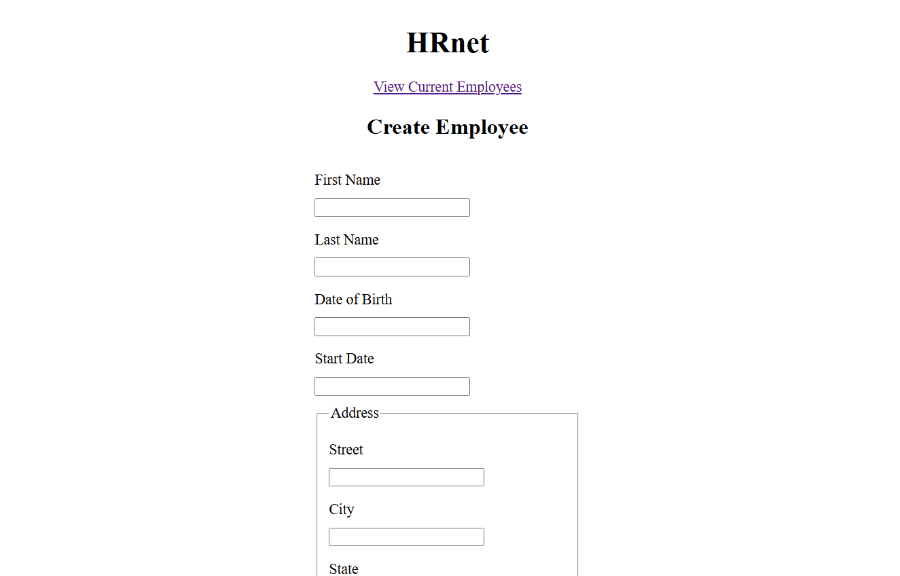
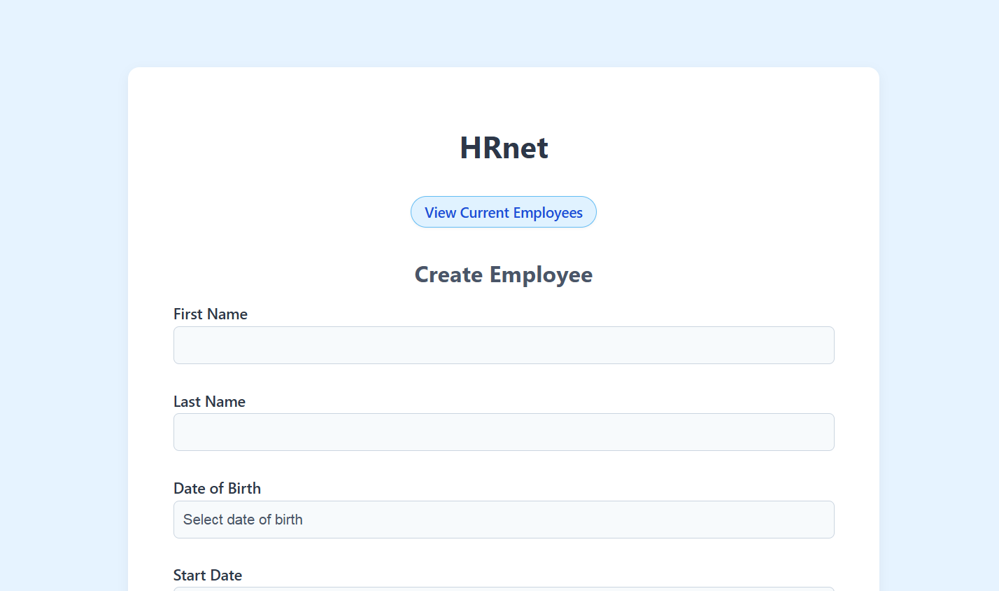
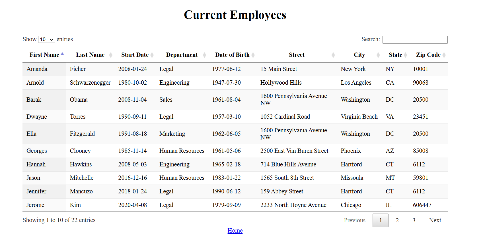
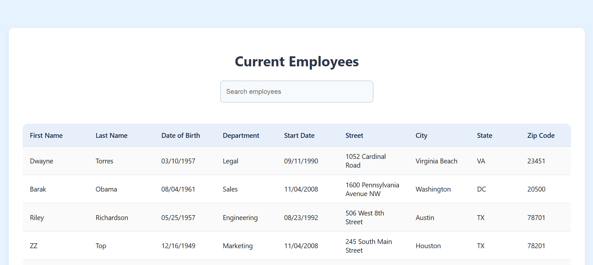

# HRnet – Migration vers React

Ce projet est une refonte de l'application **HRnet**, initialement construite avec jQuery, vers une architecture moderne basée sur **React**.  
L’objectif : rendre l’application **plus rapide**, **plus stable**, **plus maintenable**, tout en améliorant l’**expérience utilisateur (UI/UX)** et l’**accessibilité**.

---

## 🎨 Avant / Après : refonte de l'interface

Voici un comparatif visuel entre l’ancienne version de l’application (basée sur jQuery) et la nouvelle version (React + composants modernes) :

### 🧾 Formulaire “Créer un employé”

| Avant (jQuery) | Après (React) |
|----------------|---------------|
|  |  |

### 📋 Liste des employés

| Avant (jQuery) | Après (React) |
|----------------|---------------|
|  |  |

---

### 🔍 Remarques

- Le **formulaire** a été modernisé avec des composants contrôlés, une meilleure hiérarchie visuelle et une expérience utilisateur améliorée (*focus*, validation, accessibilité).
- La **table** a été remplacée par un composant React performant avec recherche, tri, pagination et styles harmonisés.

---

## ▶️ Installation & lancement

### 1. Cloner le projet

```bash
git clone https://github.com/votre-utilisateur/P14-HRNet.git
cd P14-HRNet
```

### 2. Installer les dépendances

```bash
npm install
```

### 3. Lancer l’application

```bash
npm run dev
```

L’application sera accessible sur `http://localhost:5173`

---

## ✅ Fonctionnalités converties depuis jQuery

### Formulaire “Créer un employé”

- Refonte complète du formulaire en React
- Tous les champs sont contrôlés avec `useState`, et leur validation est entièrement gérée par du code personnalisé (aucune validation automatique du navigateur ou de bibliothèque tierce). Cela permet d’afficher des messages d’erreur sur mesure et de mieux contrôler le comportement du formulaire.
- Affichage dynamique des erreurs **sans décalage visuel**
- Composants personnalisés :
  - `CustomDatePicker` (basé sur `react-datepicker`)
  - `CustomSelect` (basé sur `react-select`)
- Menus déroulants modernisés :
  - Sélection des **départements**
  - Sélection des **états américains**
- Comportement des champs harmonisé :
  - **Fond gris clair** si vide
  - **Fond blanc** au focus
- Navigation **fluide au clavier** (Tab, Entrée)

### ✅ Ajout d’un composant Modal personnalisé

Pour remplacer le plugin jQuery `jquery.modal`, un **composant React personnalisé** a été développé, publié sur npm, et intégré dans ce projet :

- 📦 **Composant utilisé** : [`react-custom-modal-publish`](https://www.npmjs.com/package/react-custom-modal-publish)
- 💡 Ce composant affiche une **fenêtre de confirmation accessible et stylisée** après l’enregistrement d’un nouvel employé
- ✨ Fonctionnalités :
  - Design cohérent avec la charte HRnet
  - Icônes FontAwesome (croix & fusée)
  - Animation fluide à l’ouverture (`fadeInScale`)
  - Fermeture possible via clic sur la croix ou le bouton “Got it”

L’affichage de la modal est déclenché via l’état local `showModal`, géré avec `useState`.

#### Exemple d’utilisation

```jsx
import { useState } from 'react'
import Modal from 'react-custom-modal-publish'

function MyComponent() {
  const [showModal, setShowModal] = useState(false)

  return (
    <>
      <button onClick={() => setShowModal(true)}>
        Create employee
      </button>

      <Modal
        isOpen={showModal}
        onClose={() => setShowModal(false)}
        title="Great news !"
      >
        <p>The new employee has been successfully created.</p>
      </Modal>
    </>
  )
}

```

### Liste des employés (“Employee List”)

- Migration vers `react-data-table-component`
- Recherche **globale** sur tous les champs
- Refonte graphique :
  - Affichage clair
  - **Surlignage des lignes impaires**
  - Harmonie avec la charte graphique générale

---

### ✨ Fonctionnalités non reproduites volontairement

#### Bouton “Maison” dans le sélecteur de date

Le plugin jQuery d’origine proposait une icône permettant de revenir rapidement à la date du jour dans le calendrier.

Cette fonctionnalité n’a pas été jugée essentielle pour ce formulaire, car les champs concernés (comme la **date de naissance** ou la **date de début de contrat**) correspondent rarement à la date du jour.

Les utilisateurs peuvent revenir rapidement à l’année ou au mois en cours grâce aux sélecteurs déjà présents.

Cette décision permet de **conserver une interface plus simple et plus légère**, sans perte d’expérience significative.

---

## 🎨 Harmonisation visuelle

- **Champs vides** : fond gris clair / **focus** : fond blanc
- **Feedback utilisateur** clair (erreurs, confirmation)
- **Navigation fluide au clavier**

---

## 📊 Rapport de performance Lighthouse

Des audits de performance ont été réalisés avec [Google Lighthouse](https://developer.chrome.com/docs/lighthouse/overview/) afin de comparer la version originale de l’application en **jQuery** et la version convertie en **React**.

- 📄 **Rapport complet (PDF)** et fichiers **JSON** disponibles dans le dossier `/Lighthouse`
- 🧪 Tests réalisés sur les pages **"Create Employee"** et **"Employee List"**
- 🔍 Mode : *Navigation* · Appareil : *Ordinateur* · Catégorie : *Performances*
- ✅ **Résultat** : 100% de performance sur les deux versions

Bien que les scores soient identiques, la version **React** offre des avantages structurels majeurs :

- **Code plus maintenable** (composants, séparation des responsabilités, gestion d’état centralisée)
- **Accessibilité renforcée** (navigation clavier, ARIA, focus visuel)
- **Interface plus moderne** (animations)
- **Plugin jQuery** remplacé par un **composant React publié sur npm**

📌 **Conclusion** : la version React est préférable à long terme pour toute évolution ou industrialisation du projet.

---

## 🛠️ Technologies utilisées

- **Vite** (environnement de développement rapide)
- **React 19**
- **Redux Toolkit** (gestion d’état)
- **react-datepicker** (sélection de dates)
- **react-select** (menus déroulants)
- **react-data-table-component** (affichage de la liste)
- **react-custom-modal-publish** (composant modal personnalisé)

### ℹ️ À propos des anciens plugins jQuery

Bien que les liens vers les anciens plugins jQuery aient été fournis (modal, sélecteurs, tables, date picker), **leur code source n’a pas été réutilisé ou converti directement**.

L’objectif principal était de **remplacer ces plugins par des composants React modernes**, plus performants, accessibles et maintenables.  

> ✅ Les fonctionnalités ont été **reproduites ou améliorées** en React sans s’appuyer sur le code jQuery d’origine, conformément aux attentes du projet (aucune dépendance jQuery dans la version React).
